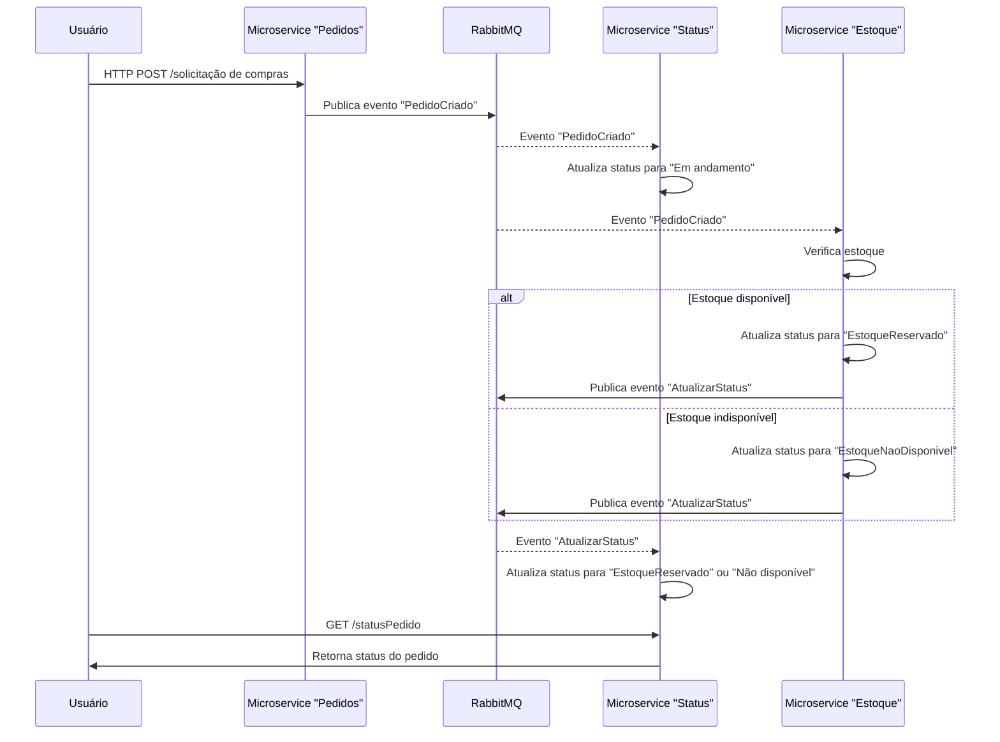

# ReservaEstoqueDemo

```mermaid
sequenceDiagram
    participant Usuário
    participant MicroservicePedidos as Microservice "Pedidos"
    participant RabbitMQ
    participant MicroserviceStatus as Microservice "Status"
    participant MicroserviceEstoque as Microservice "Estoque"

    Usuário->>MicroservicePedidos: HTTP POST /solicitação de compras
    MicroservicePedidos->>RabbitMQ: Publica evento "PedidoCriado"
    RabbitMQ-->>MicroserviceStatus: Evento "PedidoCriado"
    MicroserviceStatus->>MicroserviceStatus: Atualiza status para "Em andamento"
    RabbitMQ-->>MicroserviceEstoque: Evento "PedidoCriado"
    MicroserviceEstoque->>MicroserviceEstoque: Verifica estoque
    alt Estoque disponível
        MicroserviceEstoque->>MicroserviceEstoque: Atualiza status para "EstoqueReservado"
        MicroserviceEstoque->>RabbitMQ: Publica evento "AtualizarStatus"
    else Estoque indisponível
        MicroserviceEstoque->>MicroserviceEstoque: Atualiza status para "EstoqueNaoDisponivel"
        MicroserviceEstoque->>RabbitMQ: Publica evento "AtualizarStatus"
    end
    RabbitMQ-->>MicroserviceStatus: Evento "AtualizarStatus"
    MicroserviceStatus->>MicroserviceStatus: Atualiza status para "EstoqueReservado" ou "Não disponível"
    Usuário->>MicroserviceStatus: GET /statusPedido
    MicroserviceStatus->>Usuário: Retorna status do pedido
```