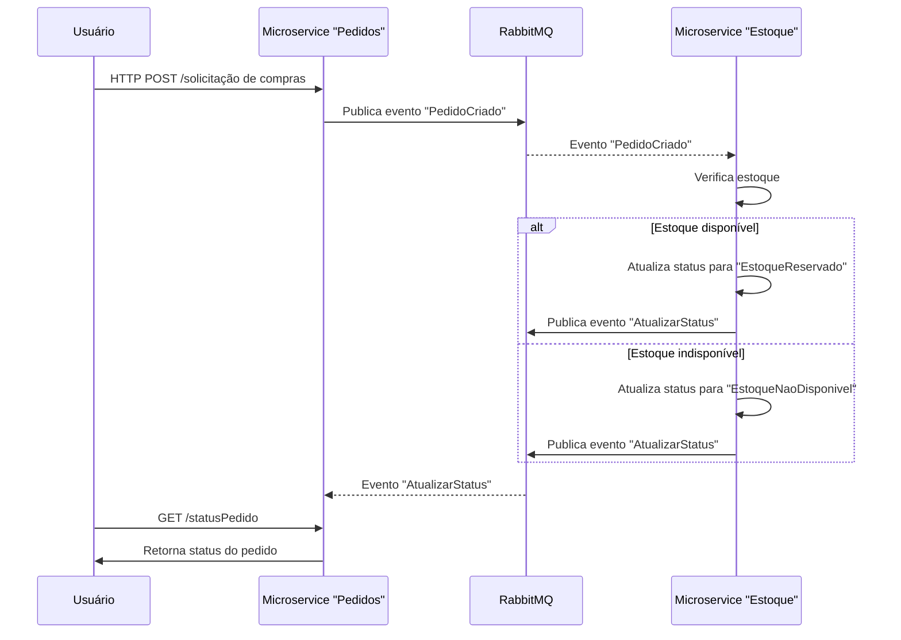
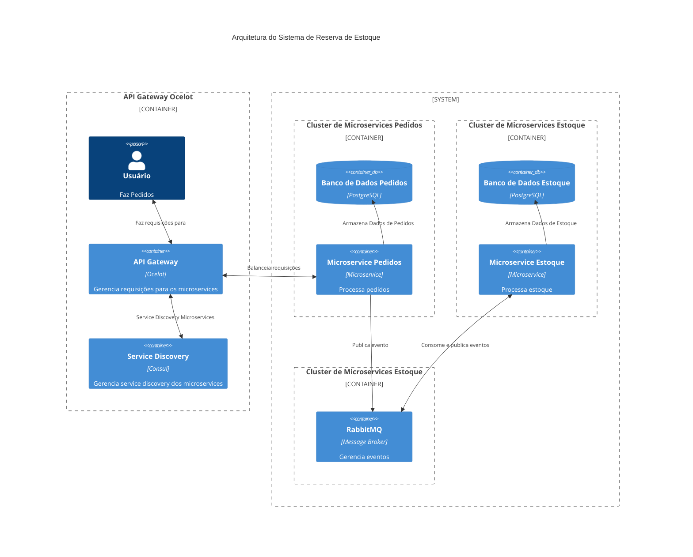

# Reserva de Estoque Demo
Essa implementação busca exemplificar a Arquitetura de Microsserviços como solução para cenários de alta disponibilidade e alta volumetria. 

Nessa demonstração vamos construir uma aplicação simplificada para controlar a reserva de estoque durante o processamento de pedidos de compra. 

Componentes:
- API Gateway Ocelot: A funcionalidade principal de um Gateway de API Ocelot é obter solicitações HTTP de entrada e encaminhá-las para um serviço downstream, simultaneamente à outra solicitação HTTP 
- Microsserviço Pedido: Responsável por gerenciar os pedidos de compras. Nesse exemplo simplificado faremos apenas as camadas responsáveis por criar pedidos, publicar eventos de novos pedidos, consumir eventos de atualização de status e permitir a consulta de status.
-  Microsserviço Estoque: Responsável por gerenciar o estoque de produtos. Nesse exemplo simplificado faremos apenas as camadas responsáveis por consultar o estoque atual de cada produto fazendo a reserva quando possível e publicando o evento informando o status do pedido.

Requisitos
- Todos os microsserviços precisam ser escaláveis horizontalmente
- A reserva de estoque precisa garantir que, mesmo em um cenário de concorrência e paralelismo, o estoque seja controlado corretamente
- Um pedido só será aceito quando houver saldo em estoque para dodos os itens
- As reservas terão um prazo de 30 minutos, após esse tempo será necessário uma nova consulta ao estoque antes de fechar o pedido.

# Diagrama de Sequência

# Arquitetura de Componentes

