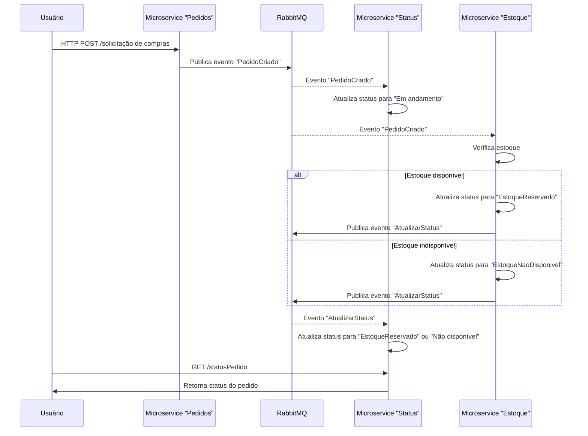
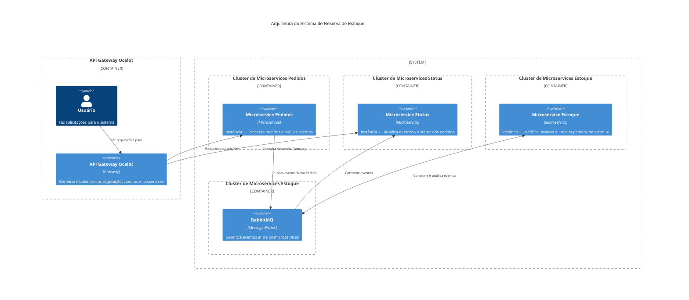

# Diagrama de Sequência

```mermaid
sequenceDiagram
    participant Usuário
    participant MicroservicePedidos as Microservice "Pedidos"
    participant RabbitMQ
    participant MicroserviceStatus as Microservice "Status"
    participant MicroserviceEstoque as Microservice "Estoque"

    Usuário->>MicroservicePedidos: HTTP POST /solicitação de compras
    MicroservicePedidos->>RabbitMQ: Publica evento "PedidoCriado"
    RabbitMQ-->>MicroserviceStatus: Evento "PedidoCriado"
    MicroserviceStatus->>MicroserviceStatus: Atualiza status para "Em andamento"
    RabbitMQ-->>MicroserviceEstoque: Evento "PedidoCriado"
    MicroserviceEstoque->>MicroserviceEstoque: Verifica estoque
    alt Estoque disponível
        MicroserviceEstoque->>MicroserviceEstoque: Atualiza status para "EstoqueReservado"
        MicroserviceEstoque->>RabbitMQ: Publica evento "AtualizarStatus"
    else Estoque indisponível
        MicroserviceEstoque->>MicroserviceEstoque: Atualiza status para "EstoqueNaoDisponivel"
        MicroserviceEstoque->>RabbitMQ: Publica evento "AtualizarStatus"
    end
    RabbitMQ-->>MicroserviceStatus: Evento "AtualizarStatus"
    MicroserviceStatus->>MicroserviceStatus: Atualiza status para "EstoqueReservado" ou "Não disponível"
    Usuário->>MicroserviceStatus: GET /statusPedido
    MicroserviceStatus->>Usuário: Retorna status do pedido
```

# Arquitetura de Componentes

```mermaid
C4Context
title Arquitetura do Sistema de Reserva de Estoque

Container_Boundary(Gateway, "API Gateway Ocelot") {    
    Person(Usuario, "Usuário", "Faz solicitações para o sistema")
    Container(API_Gateway, "API Gateway Ocelot", "Gateway", "Gerencia e balanceia as requisições para os microservices")    
}

System_Boundary(Componentes, "") {
    Container_Boundary(PedidosCluster, "Cluster de Microservices Pedidos") {
        Container(MicroservicePedidos1, "Microservice Pedidos", "Microservice", "Instância 1 - Processa pedidos e publica eventos")
        
    }

    Container_Boundary(StatusCluster, "Cluster de Microservices Status") {
        Container(MicroserviceStatus1, "Microservice Status", "Microservice", "Instância 1 - Atualiza e retorna o status dos pedidos")
        
    }

    Container_Boundary(EstoqueCluster, "Cluster de Microservices Estoque") {
        Container(MicroserviceEstoque1, "Microservice Estoque", "Microservice", "Instância 1 - Verifica, reserva ou rejeita pedidos de estoque")
        
    }

    Container_Boundary(MessageBroker, "Cluster de Microservices Estoque") {
        Container(MessageBroker1, "RabbitMQ", "Message Broker", "Gerencia eventos entre os microservices")
    }
    
}

Rel(Usuario, API_Gateway, "Faz requisições para")
Rel(API_Gateway, MicroservicePedidos1, "Balanceia requisições")
Rel(MicroservicePedidos1, MessageBroker1, "Publica evento 'Novo Pedido'")
Rel(MessageBroker1, MicroserviceStatus1, "Consome eventos")
BiRel(MessageBroker1, MicroserviceEstoque1, "Consome e publica eventos")
Rel(API_Gateway, MicroserviceStatus1, "Consulta status via Gateway")

UpdateLayoutConfig($c4ShapeInRow="1", $c4BoundaryInRow="3")
```

